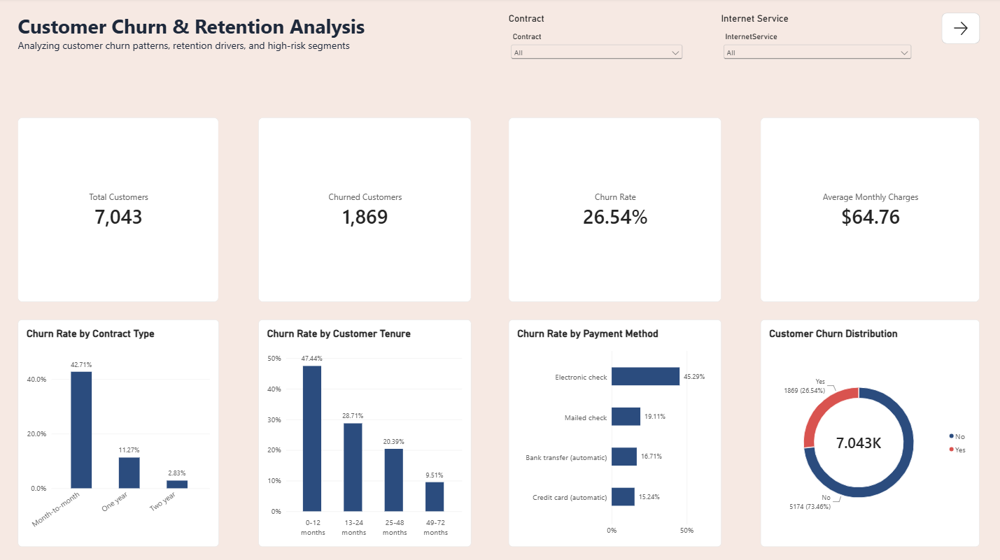
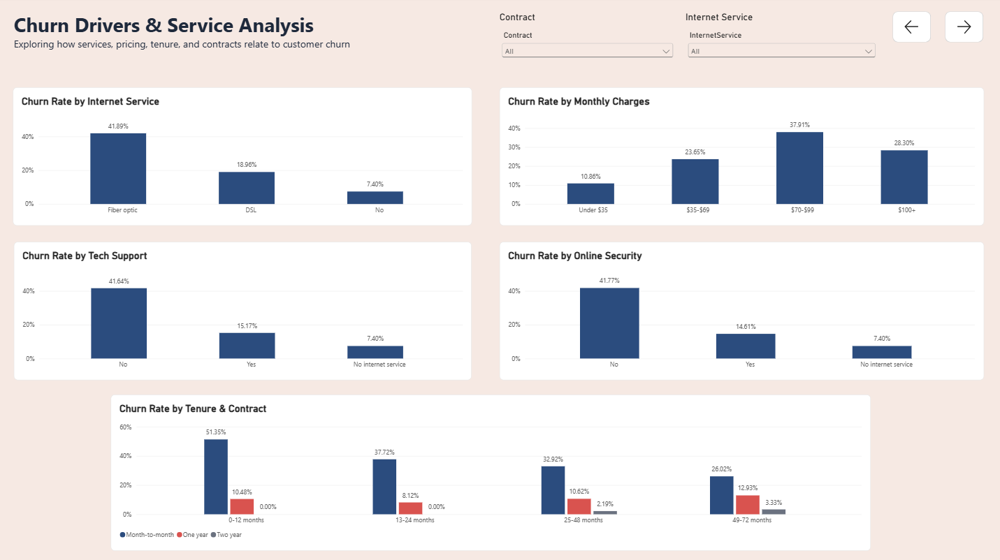
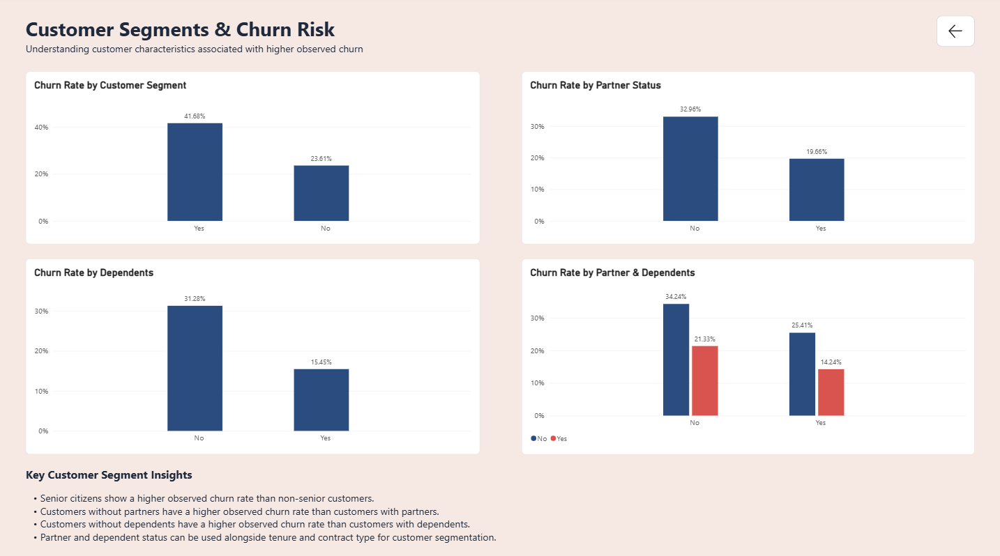

# 📊 Customer Churn & Retention Analysis

An end-to-end **Data Analytics project** analyzing customer churn patterns, retention behavior, service usage, pricing, contracts, and customer segments using **Python, SQL, and Power BI**.

The project transforms raw telecom customer data into actionable business insights and an interactive Power BI dashboard that helps identify customer groups associated with higher observed churn.

---

## 📌 Project Overview

Customer churn is a major business challenge for subscription-based companies. Understanding **who is leaving, which customer characteristics are associated with churn, and where retention risks are concentrated** can help businesses design more targeted retention strategies.

This project analyzes **7,043 telecom customers** and investigates churn across:

* Contract type
* Customer tenure
* Internet service
* Payment method
* Monthly charges
* Technical support
* Online security
* Partner and dependent status
* Senior citizen status
* Combined customer segments

The analysis combines **Python-based data preparation and EDA, SQL business analysis, and Power BI visualization**.

---

## 🎯 Business Questions

The analysis aims to answer:

1. What percentage of customers have churned?
2. Which contract types have higher observed churn?
3. How does customer tenure relate to churn?
4. Which payment methods are associated with higher churn?
5. Does internet service type show differences in churn rates?
6. How do monthly charges relate to churn?
7. Are customers without technical support or online security associated with higher churn?
8. Which customer segments show higher observed churn?
9. Which combinations of customer characteristics represent higher-risk segments?

---

## 🛠️ Tools & Technologies

| Tool             | Purpose                                        |
| ---------------- | ---------------------------------------------- |
| **Python**       | Data inspection, cleaning, EDA & visualization |
| **Pandas**       | Data manipulation and analysis                 |
| **Matplotlib**   | Data visualization                             |
| **MySQL**        | SQL-based business analysis                    |
| **Power BI**     | Interactive dashboard & reporting              |
| **Git & GitHub** | Version control and project documentation      |
| **VS Code**      | Development environment                        |

---

## 📂 Dataset

**IBM Telco Customer Churn Dataset**

The dataset contains customer-level information including:

* Demographics
* Account information
* Services subscribed
* Contract details
* Monthly charges
* Total charges
* Churn status

### Dataset Size

* **7,043 customers**
* **21 original columns**
* **22 columns after cleaning and feature creation**

---

# 🔄 Project Workflow

```text
Raw Dataset
     ↓
Data Inspection
     ↓
Data Cleaning & Feature Engineering
     ↓
Exploratory Data Analysis
     ↓
SQL Business Analysis
     ↓
Power BI Dashboard
     ↓
Business Insights
```

---

# 🐍 1. Python — Data Preparation & EDA

Python was used to inspect, clean, transform, and explore the dataset.

### Data Cleaning

The cleaning process included:

* Checking dataset dimensions and data types
* Identifying missing values
* Converting `TotalCharges` to numeric
* Handling blank `TotalCharges` values
* Converting `SeniorCitizen` from `0/1` to `No/Yes`
* Creating a numerical `ChurnFlag`
* Checking duplicate records
* Creating tenure and monthly-charge segments

### Feature Engineering

Created:

```text
ChurnFlag
Tenure Group
Monthly Charge Group
Monthly Charge Sort
```

### Key Dataset Metrics

| Metric             |  Value |
| ------------------ | -----: |
| Total Customers    |  7,043 |
| Churned Customers  |  1,869 |
| Retained Customers |  5,174 |
| Overall Churn Rate | 26.54% |

---

# 🗄️ 2. MySQL — Business Analysis

The cleaned dataset was imported into MySQL for structured SQL analysis.

The SQL analysis covers:

* Overall churn rate
* Churn by contract
* Churn by tenure
* Churn by payment method
* Churn by internet service
* Churn by monthly charge segment
* Churn by technical support
* Churn by online security
* Churn by partner/dependent status
* Churn by senior citizen status
* High-risk customer segmentation

SQL concepts demonstrated:

* `GROUP BY`
* Aggregate functions
* `CASE`
* Conditional aggregation
* Filtering
* Segmentation
* Percentage calculations
* Multi-dimensional analysis

---

# 📈 3. Power BI Dashboard

The Power BI dashboard is divided into three pages to keep the analysis clear and easy to explore.

## Page 1 — Executive Overview

Provides a high-level summary of customer churn.

### KPIs

* Total Customers
* Churned Customers
* Churn Rate
* Average Monthly Charges

### Visuals

* Customer Churn Distribution
* Churn Rate by Contract Type
* Churn Rate by Customer Tenure
* Churn Rate by Payment Method

Interactive slicers are provided for:

* Contract
* Internet Service

---

## Page 2 — Churn Drivers & Service Analysis

Explores factors associated with customer churn.

### Visuals

* Churn Rate by Internet Service
* Churn Rate by Monthly Charges
* Churn Rate by Technical Support
* Churn Rate by Online Security
* Churn Rate by Tenure & Contract

---

## Page 3 — Customer Segments & Churn Risk

Examines customer characteristics and observed churn differences.

### Visuals

* Churn Rate by Customer Segment
* Churn Rate by Partner Status
* Churn Rate by Dependents
* Churn Rate by Partner & Dependents

The dashboard also includes page-to-page navigation for easier exploration.

---

# 🔎 Key Findings

### Contract Type

Month-to-month customers show a substantially higher observed churn rate than customers on one-year or two-year contracts.

* Month-to-month: **42.71%**
* One year: **11.27%**
* Two year: **2.83%**

---

### Customer Tenure

Short-tenure customers show higher observed churn.

* 0–12 months: **47.44%**
* 13–24 months: **28.71%**
* 25–48 months: **20.39%**
* 49–72 months: **9.51%**

This highlights the early customer lifecycle as an important area for retention analysis.

---

### Payment Method

Customers using electronic checks show a higher observed churn rate compared with customers using automatic bank transfers or credit cards.

* Electronic check: **45.29%**
* Mailed check: **19.11%**
* Bank transfer (automatic): **16.71%**
* Credit card (automatic): **15.24%**

---

### Internet Service

Fiber optic customers show a higher observed churn rate than DSL and customers without internet service.

* Fiber optic: **41.89%**
* DSL: **18.96%**
* No internet service: **7.40%**

---

### Monthly Charges

Customers who churned had a higher average monthly charge than retained customers.

| Customer Group | Average Monthly Charges |
| -------------- | ----------------------: |
| Retained       |                  $61.27 |
| Churned        |                  $74.44 |

---

### Customer Characteristics

Observed churn is also higher among:

* Senior citizens compared with non-senior customers
* Customers without partners compared with customers with partners
* Customers without dependents compared with customers with dependents

These characteristics can be combined with tenure, contract, and service information for customer segmentation.

---

## ⚠️ Analytical Note

The findings in this project represent **observed associations in the dataset and should not be interpreted as proof of causation**.

For example, a higher churn rate among a particular contract or payment group does not by itself establish that the contract or payment method caused the churn.

---

# 🖼️ Dashboard Preview

## Executive Overview



## Churn Drivers



## Customer Segments



---

## 📓 Jupyter Notebook

A detailed Jupyter Notebook documents the complete Python-based analysis, including:

- Data loading and inspection
- Data cleaning and feature engineering
- Exploratory data analysis
- Churn analysis by contract, tenure, payment method, and services
- Customer segmentation
- Key findings and business recommendations

👉 [View the Customer Churn Analysis Notebook](notebooks/customer_churn_analysis.ipynb)

---

# 📁 Project Structure

```text
customer-churn-analysis/
│
├── data/
│   ├── raw/
│   │   └── WA_Fn-UseC_-Telco-Customer-Churn.csv
│   │
│   └── cleaned/
│       └── telco_customer_churn_cleaned.csv
│
├── python/
│   ├── 01_data_inspection.py
│   ├── 02_data_cleaning.py
│   ├── 03_eda.py
│   ├── 04_visualizations.py
│   └── 05_import_to_mysql.py
│
├── sql/
│   └── churn_analysis.sql
│
├── dashboard/
│   └── customer_churn_analysis.pbix
│
├── images/
│   ├── 01_churn_distribution.png
│   ├── 02_churn_by_contract.png
│   ├── 03_churn_by_tenure.png
│   ├── 04_churn_by_payment_method.png
│   ├── 05_churn_tenure_contract.png
│   ├── 06_churn_contract_internet.png
│   ├── 07_monthly_charges_by_churn.png
│   ├── 01_executive_overview.png
│   ├── 02_churn_drivers.png
│   └── 03_customer_segments.png
│
├── .gitignore
├── README.md
└── .env
```

> `.env` contains local database credentials and should **never be committed to GitHub**.

---

# ▶️ How to Run the Project

### 1. Clone the repository

```bash
git clone https://github.com/divya280904/customer-churn-analysis.git
cd customer-churn-analysis
```

### 2. Install Python dependencies

```bash
pip install pandas matplotlib mysql-connector-python python-dotenv
```

### 3. Run the Python workflow

```bash
python python/01_data_inspection.py
python python/02_data_cleaning.py
python python/03_eda.py
python python/04_visualizations.py
```

### 4. Configure MySQL

Create a `.env` file in the project root:

```text
MYSQL_HOST=localhost
MYSQL_USER=root
MYSQL_PASSWORD=your_password
MYSQL_DATABASE=customer_churn
```

### 5. Import the cleaned data

```bash
python python/05_import_to_mysql.py
```

### 6. Run SQL analysis

Open:

```text
sql/churn_analysis.sql
```

in MySQL Workbench and execute the analysis queries.

### 7. Open the Power BI dashboard

Open:

```text
dashboard/customer_churn_analysis.pbix
```

---

# 💡 Skills Demonstrated

### Data Analytics

* Data cleaning
* Exploratory data analysis
* Customer segmentation
* Churn analysis
* Business insight generation

### Python

* Pandas
* Data transformation
* Feature engineering
* Matplotlib

### SQL

* Aggregations
* Grouping
* Conditional logic
* Segmentation
* Business-oriented queries

### Power BI

* DAX measures
* Calculated columns
* KPI cards
* Slicers
* Interactive dashboards
* Page navigation
* Data visualization

### Data Storytelling

The project focuses on converting raw customer data into **clear business questions, measurable findings, and decision-support visualizations**.

---

# 🚀 Future Improvements

Potential extensions include:

* Churn prediction using machine learning
* Customer lifetime value analysis
* Cohort-based retention analysis
* Automated Power BI data refresh
* Additional customer segmentation
* Predictive churn scoring
* Retention campaign analysis

---

## 👩‍💻 Author

**Divya Gupta**

Aspiring **Data Analyst | Full Stack Developer**

Interested in data analytics, business intelligence, SQL, Python, and AI-powered applications.
